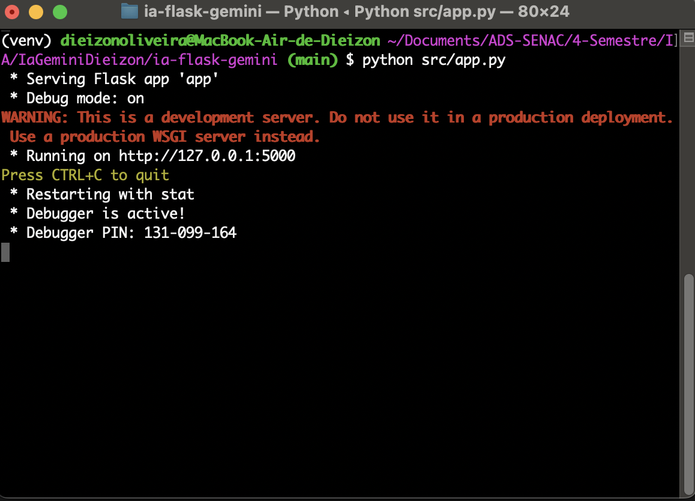
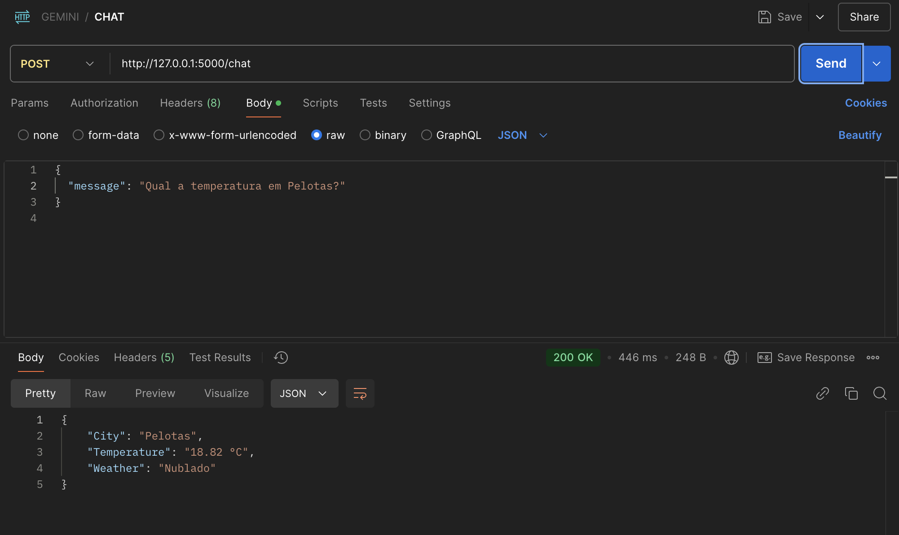
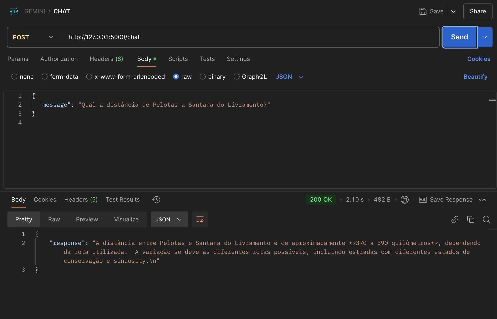
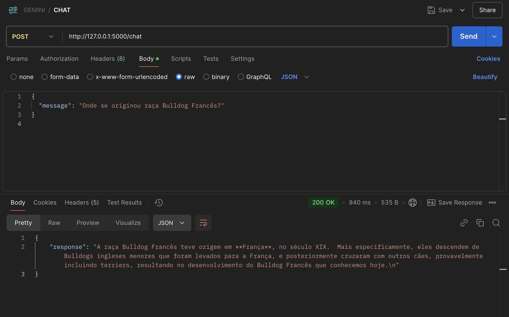

Chatbot com Gemini 1.5 Flash e Previsão do Tempo através da API OpenWeatherMap

Projeto avaliativo da Disciplina de Inteligencia Artificial da Unisenac - Ministrada
pelo Professor Pablo de Chiaro Rosa, Mestre em Computação, trabalho o qual implementa um chatbot interativo utilizando o modelo Gemini 1.5 Flash do Google e a API OpenWeatherMap, que fornece dados metereológicos de cidades de todo mundo.

Configuração do ambiente:
Este guia passo a passo apresenta como configurar o ambiente, obter a chave de API e rodar o chatbot localmente:

Passo 1: Configuração do Ambiente
Instale o Python 3.10 ou superior:

Baixe e instale o Python a partir do site oficial do Python.
(Código testado com o Python 3.12.2)

Crie um ambiente virtual:

python -m venv venv
Isso evita que os requisitos deste projeto se misturem com os demais da máquina

Ative o ambiente virtual:

Windows:
venv\Scripts\activate
macOS/Linux:
source venv/bin/activate

Execute o seguinte comando para garantir que o Python que está sendo usado é o do ambiente virtual: 
Windows: where python 
macOS/Linux: which python
O caminho deve apontar para o diretório do ambiente virtual, algo com venv: 'c:\caminho\do\projeto\venv\Scripts\python.exe'

Instale as bibliotecas necessárias:

pip install -q -U google-generativeai Flask
Passo 2: Obtenção da Chave de API do Gemini
Crie uma conta no Google AI Studio:

Acesse o Google AI Studio.
Obtenha a chave de API:

Siga o guia detalhado disponível neste link: Gemini API Quickstart.
Configure a chave de API no terminal:

Windows:
set GEMINI_API_KEY=sua_chave_api_aqui

macOS/Linux:
export GEMINI_API_KEY=sua_chave_api_aqui

Passo 3: Desenvolvimento do Chatbot
Crie o arquivo app.py:

No diretório src, crie um arquivo chamado app.py com o código fornecido neste repositório. Ou se preferir apenas clone todo projeto para sua máquina com git clone
Execute o servidor Flask:

No terminal, execute o seguinte comando para iniciar o servidor:
python src/app.py

Interaja com o chatbot:

Use o comando curl para testar o chatbot:
curl -X POST http://127.0.0.1:5000/chat -H "Content-Type: application/json" -d "{"message": "Olá, como você está?"}"

O Projeto

1. Visão Geral
O objetivo deste projeto foi desenvolver uma API de chatbot que fornece informações sobre o clima (previsão do tempo) para uma cidade especificada pelo usuário, utilizando a API do OpenWeatherMap, e também gera respostas utilizando o modelo Gemini da Google. A API foi construída com Flask, e a comunicação com as APIs externas é feita via requisições HTTP.

2. APIs Utilizadas
2.1 API do OpenWeatherMap (Previsão do Tempo)
Objetivo: Esta API é utilizada para obter informações sobre o clima e a temperatura de uma cidade fornecida pelo usuário.
Integração: A chave da API foi configurada dentro da função get_weather(), que monta a URL da API com a cidade informada, realiza a requisição HTTP GET e retorna os dados em formato JSON, com a descrição do clima e a temperatura em Celsius.
Exemplo de Requisição:
python

url = f"http://api.openweathermap.org/data/2.5/weather?q={city}&appid={api_key}&units=metric&lang=pt_br"

Dados Retornados: A resposta contém informações como descrição do clima (ex: "céu limpo") e a temperatura em graus Celsius.

2.2 API Gemini (Geração de Conteúdo)
Objetivo: Utilizada para gerar respostas inteligentes sobre qualquer tema que não seja relacionado ao clima.
Integração: O modelo Gemini foi configurado através da biblioteca google.generativeai, onde a chave da API foi configurada para gerar conteúdo de forma dinâmica a partir do texto fornecido.
Exemplo de Requisição:
python

model = genai.GenerativeModel('gemini-1.5-flash')
response = model.generate_content(prompt)
Dados Retornados: O modelo gera respostas baseadas na entrada do usuário, seja ela uma pergunta ou uma solicitação de informação.

3. Funcionamento da API
O funcionamento da API é baseado na interação com o usuário por meio de um chatbot. Quando o usuário envia uma mensagem, o processo segue as etapas descritas abaixo:
Extração da Cidade: A função extract_city_from_input() verifica se o usuário mencionou uma cidade e se a entrada é relacionada ao clima (usando palavras-chave como "temperatura", "tempo", "previsão", etc.). A cidade pode ser extraída de qualquer parte da frase fornecida pelo usuário.
Obter Dados do Clima: Se o usuário mencionar uma cidade e palavras-chave relacionadas ao clima, a função get_weather() é chamada para consultar a API do OpenWeatherMap e retornar a previsão do tempo para a cidade fornecida.
Geração de Resposta pelo Gemini: Se o usuário não mencionar uma cidade ou se a entrada não estiver relacionada a clima, a entrada é enviada para o modelo Gemini para gerar uma resposta inteligente sobre outro tema.
Resposta ao Usuário: Dependendo do tipo de entrada, o sistema responde com a previsão do tempo (se relacionada a clima) ou uma resposta gerada pelo modelo Gemini (para outros tipos de perguntas).

4. Exemplos de Interações
Interação 1: Previsão do Tempo
Entrada:
Usuário: "Qual a temperatura em Pelotas?"
Resposta:
API: Retorna a previsão do tempo para Pelotas, com a descrição do clima e a temperatura atual.

Interação 2: Geração de Conteúdo
Entrada:
Usuário: "Qual a distância de Pelotas a Santana do Livramento?"
Resposta:
Gemini: Gera uma resposta inteligente sobre a história da internet, com base no prompt.

Interação 3: Curiosidades
Entrada:
Usuário: "Onde se originou raça Bulldog Francês?"
Resposta:
Gemini: Gera uma resposta sobre a raça de cães.

5. Limitações e Considerações
Limitação de Respostas do Gemini: O modelo Gemini pode gerar respostas que nem sempre são precisas ou relevantes, dependendo da qualidade do prompt fornecido. Pode ser necessário fornecer prompts mais específicos para obter respostas melhores.
Dependência de APIs Externas: O sistema depende das APIs externas para fornecer dados. Se a API do OpenWeatherMap ou do Gemini estiver fora do ar ou se a chave de API for inválida, o sistema não será capaz de fornecer as informações desejadas.
Limitação no Tratamento de Cidades: A função de extração de cidade depende de uma comparação simples com palavras-chave e pode não ser capaz de identificar corretamente todas as variações de nomes de cidades, especialmente se o nome da cidade não for fornecido após a palavra "em".
Chaves de API: As chaves de API devem ser mantidas seguras. Caso a chave do OpenWeatherMap ou a chave do Gemini seja comprometida ou expirada, o sistema não funcionará corretamente até que as chaves sejam atualizadas.
Performance: A performance depende das respostas das APIs externas e pode variar dependendo da latência da rede ou da carga nos servidores de terceiros.

6. Conclusão
Este chatbot é uma aplicação interativa que combina dois serviços poderosos (OpenWeatherMap e Gemini) para fornecer uma experiência útil ao usuário. O chatbot é capaz de fornecer previsões do tempo para qualquer cidade mencionada e também gerar respostas inteligentes sobre uma variedade de temas. Apesar das limitações, a solução é escalável e pode ser expandida para incluir mais funcionalidades no futuro.
